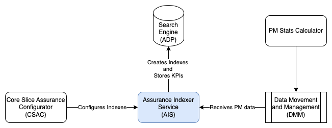
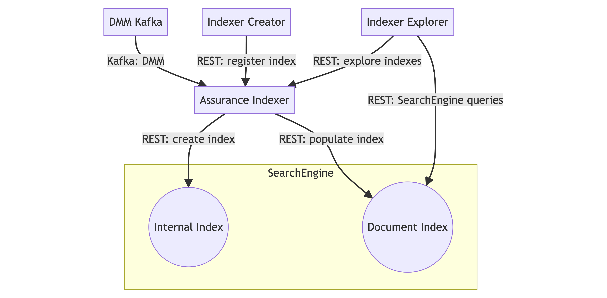

<!--Document Template information:
Prepared:Stefano Volpe
Approved:***
Document Name:user-guide-template
Revision: {!.bob/var.user-guide-version!}
Date: {!.bob/var.date!}
-->

# Assurance Indexer User Guide

[TOC]

## Overview

This document provides an overview of the Assurance Indexer Service.

A Slice administrator would like to view the aggregation KPIs that have been calculated by the PM Stats Calculation Handler. The administrator would like to search for the KPIs based on the aggregation_elements used, and the values of the KPIs. The PM Stats Calculation Handler exposes the KPIs as records on a DMM stream.

<!--- ### Supported Use Cases

This chapter gives an overview of the supported use cases.

 Use Case ID | Use Case Title | Compliance
---|---|---
 <*UC.ID*> | <*UC Slogan*> | <*Fully supported or list deviations*>

TODO Sumana-->

### Architecture

The following picture shows the Assurance Indexer Service and its architectural context.



Figure 1 Architecture view of Assurance Indexer

<!--- #### Logical Interfaces

Interface Logical Name | Interface Realization | Description | Interface Maturity
---|---|---|---
<*INT.NAME*> | <*Link to specification, JSON, documentation, etc.*> | <*Short description of the interface*> | <*(Alpha, Beta, Stable)*>

TODO? --->

<!--- #### Application Programming Interfaces (APIs)

This chapter gives an overview of included APIs and their maturity. APIs with Alpha or Beta maturity should only be used for tests and are not ready for production use.

<*List all APIs and API versions included in the release. List all versions if you include/support multiple versions of the same API.*>

HTTP list

API | API Version | API Slogan | API Maturity
---|---|---|---
<*Product Number*> | <*API Version*> | <*API Slogan*> | <*Alpha, Beta, Stable*> --->

### Deployment View

Assurance Indexer is packaged as a Docker container. It supports deployment in Kubernetes using Helm.



<!--
```mermaid
flowchart TD
    DMM[DMM Kafka] ->|Kafka: DMM| AssuranceIndexer
    subgraph SearchEngine
        InternalIndex((Internal Index))
        DocumentIndex((Document Index))
    end
    IndexerCreator[Indexer Creator] -> |REST: register index| AssuranceIndexer[Assurance Indexer]
    IndexerExplorer[Indexer Explorer] -> |REST: explore indexes| AssuranceIndexer
    AssuranceIndexer -> |REST: populate index| DocumentIndex
    AssuranceIndexer -> |REST: create index| InternalIndex
    IndexerExplorer -> |REST: SearchEngine queries| DocumentIndex
```
--->

Figure 2 Deployment view of Assurance Indexer

To deploy the Service, refer to the [Deployment section](#deployment), which:

- explains how to get started using the Assurance Indexer Service in the supported environments.

- specifies configuration options for starting the Assurance Indexer docker container.

If problems occur when using the service, refer to the [Troubleshooting section](#troubleshooting).

### Dimensioning and Characteristics

#### Dimensioning

Dimensioning is static and should be set as such:

Assurance Indexer
Min 2GB
Max 2GB
Min vCPU 500m
Max vCPU 500m

To handle dimensioning configuration at deployment time, refer to the [Deployment section](#deployment).

#### Scaling

Autoscaling will not be supported in this release. Manual scaling is supported for high availability. The horizontal scalability of the Assurance Indexer is effectively limited to the number of partitions in Kafka.

Scaling Supported (Yes/No) | Minimum number of instances | Maximum number of recommended instances 
---------------------------|-----------------------------|-----------------------------------------
            Yes            | 1                           | Number of partitions in the Kafka topic

<!--- To be added at a later date when there is an established approach for determining baselines

#### Characteristics
| Characteristic                                               | Description                                                                                                                                                                                                                                                    | Result |
|--------------------------------------------------------------|----------------------------------------------------------------------------------------------------------------------------------------------------------------------------------------------------------------------------------------------------------------|--------|
| Startup time (to fully ready)                                | It is from the point where the service is allowed to start, i.e. dependencies startup and scheduling time excluded from the measurement.                                                                                                                       | TBD    |
| Restart time (to fully ready)                                | Measure from the point where a POD is killed until the service instance is fully ready.                                                                                                                                                                        | TBD    |
| Upgrade time (to fully ready)                                | Measure time from the point 'helm upgrade' is executed until the upgrade is completed and service instance is fully ready. Upgrade shall be executed under "traffic" and service shall be considered fully ready when traffic disturbance (if any) is over.    | TBD    |
| Rollback time (to fully ready)                               | Measure time from the point 'helm rollback' is executed until the rollback is completed and service instance is fully ready. Rollback shall be executed under "traffic" and service shall be considered fully ready when traffic disturbance (if any) is over. | TBD    |
| Image Size                                                   | CSAC docker image size                                                                                                                                                                                                                                         | TBD    |
| Microservice memory footprint required                       | This is the memory footprint required to achieve your published SLO                                                                                                                                                                                            | TBD    |
| Microservice CPU footprint required                          | This is the CPU footprint required to achieve your published SLO                                                                                                                                                                                               | TBD    |
| Some kind of meaningful latency or throughput for your “API” | This is characterized by the time from loading the resource configuration from file to completion of provisioning of the downstream consumers (PMSC, AAS, Indexing)                                                                                            | TBD    |
| Average KPI resource loading time                            | This is the average time taken for loading a single KPI. It is calculated by incrementally adding 1 KPI to the config file and calculating average of the load time per KPI                                                                                    | TBD    |

-->

#### Resilience

Assurance Indexer supports high availability of its REST API through multiple pod instances. In order to configure the Assurance Indexer for high availability, it is initialised with 2 instances by default along with a Burstable Kubernetes Quality of Service class. For further information about QoS classes, see [here](https://kubernetes.io/docs/concepts/workloads/pods/pod-qos/#burstable)

#### Upgrade - In Service Software Upgrade

````text
$ helm upgrade eric-oss-assurance-indexer -n <NAMESPACE> eric-oss-assurance-indexer-x.x.x-x.tgz --set appArmorProfile.type=unconfined,global.pullSecret=k8s-registry-secret
````

<*Describe how the service supports upgrades, that is how the service fulfills the ISSU requirement. Describe from a function point of view how ISSU is supported and what a service unavailability would mean for this particular service. Do not include practical commands, that is the scope of the Deployment section*>

#### High Availability
The Assurance Indexer supports high availability, and the following configurations are provided by default in the values.yaml file:

Step 1. Set pod anti-affinity rule to soft in values.yaml such that scheduler still schedules the pod even if it can't find a matching node.
There are two options: preferredDuringScheduling (or hard), IgnoredDuringExecution (or soft).

````text
affinity:
  podAntiAffinity: "soft"
````

Step 2. Support setting the topology spread constraints (default = undefined) in the values.yaml to help schedule pods across user-defined topologies, such as zones or regions.
In topology spread constraints, options include maxSkew, minDomains, topologyKey, labelSelector,label selectors and matchLabelKeys.

````text
nodeSelector: { }
topologySpreadConstraints:
  deployment: [ ]
  test: [ ]
````

Step 3. Configure pre-stop hook with terminationGracePeriodSeconds in values.yaml.

````text
terminationGracePeriodSeconds: 30
````

Step 4. Set the Quality of Service config for pod eviction policy for resource issues on the node to Burstable by making resource request memory equal to less than the resource limit memory (by default we request 256Mi / 2Gi limit for memory and 125m / 500m limit for cpu).
There are 3 option for Quality of Service class - Guaranteed, Burstable or BestEffort.
This can be viewed in the specification of containers (pods).

````text
status:
    qosclass: Burstable
````

Step 5. Configure the mandatory liveness and readiness health probes in the values.yaml.

````text
probes:
    eric-oss-core-slice-assurance-cfg:
        livenessProbe:
            failureThreshold: 3
            initialDelaySeconds: 60
            periodSeconds: 10
            timeoutSeconds: 10
        readinessProbe:
            failureThreshold: 3
            initialDelaySeconds: 60
            periodSeconds: 10
            timeoutSeconds: 10
````

## Deployment

This section describes the operational procedures for how to deploy and upgrade the Assurance Indexer Service in a Kubernetes environment with Helm. It also covers hardening guidelines to consider when deploying this service.

### Prerequisites

-  A running Kubernetes environment with helm support, some knowledge of the Kubernetes environment, including the networking detail, and access rights to deploy and manage workloads.

-  Access rights to deploy and manage workloads.

-  Availability of the kubectl CLI tool with correct authentication details. Contact the Kubernetes System Admin if necessary.

-  Availability of the helm package.

-  Availability of Helm charts and Docker images for the service and all dependent services.

-  A Search Engine instance

-  A DMM (Schema registry and Kafka) instance

-  The Search engine must be configured in BAM to allow modification of records in the 'internal-index' collection and all collections with the 'assurance' prefix.

### Custom Resource Definition (CRD) Deployment

Custom Resource Definitions (CRD) are cluster-wide resources which must be installed prior to the Generic Service deployment. The service that requires the latest CRD charts version sets which CRD charts version to use in the deployment.

>Note! The release name chosen for the CRD charts in the K8s deployment must be kept and cannot be changed later. Helm ALWAYS requires a namespace to deploy a chart and the namespace to be used for the same per-service CRDs chart must be created before the CRDs charts are loaded.

>Note! The upgrade of the CRDs must be done before deploying a service that requires additional CRDs or a CRD version newer than the one already deployed on the K8s cluster.

The CRD chart are deployed as follows:

1. Download the latest applicable CRD charts files from the helm charts repository.

2. Create the `namespace` where CRD charts will be deployed in case it doesn't already exist. This step is only done once on the K8s cluster.

   ```
    kubectl create namespace <NAMESPACE-FOR-CRDs>
    ```

3. Deploy the CRD using `helm upgrade` command:

   ```
    helm upgrade --install --atomic <release name> <CRD chart with version> --namespace <NAMESPACE-FOR-CRDs>
    ```

4. Validate the CRD installation with the `helm ls` command:

   ```
    helm ls -a
    ```

In the table locate the entry for the `<release name>`, validate the `NAMESPACE` value and check that the STATUS is set to `deployed`. When the output is validated continue with the installation of the helm charts.

To verify that the CRD was installed correctly, the logs of that job can be used instead of the step above.

<!--- In this case the following log entries indicate a successful CRD charts deployment:

* TODO-->

### Deployment in a Kubernetes Environment Using Helm

This section describes how to deploy the service in Kubernetes using Helm and the `kubectl` CLI client. Helm is a package manager for Kubernetes that streamlines the installation and management of Kubernetes applications.

#### Preparation

Prepare helm chart and docker images. Helm chart in the following link can be used for installation:

[Link to helm chart package in ARM](https://arm.seli.gic.ericsson.se/artifactory/proj-eric-oss-drop-helm/eric-oss-assurance-indexer/)

#### Pre-Deployment Checks for Assurance Indexer

TODO?

Ensure the following:

- The <RELEASE_NAME> is not used already in the corresponding cluster. Use `helm list` command to list the existing deployments (and delete previous deployment with the corresponding <RELEASE_NAME> if needed).

- The same namespace is used for all deployments.

#### Helm Chart Installations of Dependent Services

- [SearchEngine Service User Guide](https://adp.ericsson.se/marketplace/search-engine/documentation/12.7.0/dpi/service-user-guide)

- [Schema Registry Service User Guide](https://adp.ericsson.se/marketplace/schema-registry-sr/documentation/1.51.1/dpi/service-user-guide)

- [Kafka Service User Guide](https://adp.ericsson.se/marketplace/message-bus-kf/documentation/2.14.0/dpi/service-user-guide#deployment)

#### Helm Chart Installation of Assurance Indexer Service

>**Note!** Ensure all dependent services are deployed and healthy before you continue with this step (see previous chapter).

Helm is a tool that streamlines installing and managing Kubernetes applications. Assurance Indexer can be deployed on Kubernetes using Helm Charts. Charts are packages of pre-configured Kubernetes resources.

Users can override the default values provided in the values.yaml template of the helm chart. The recommended parameters to override are listed in the following section: [Configuration Parameters](#configuration-parameters).

##### Deploy the Assurance Indexer Service

Install the Assurance Indexer on the Kubernetes cluster by using this helm installation command:

```text
helm install <CHART_REFERENCE> --name <RELEASE_NAME> --namespace <NAMESPACE> [--set <other_parameters>]
```

The variables specified in the command are as follows:

- `<CHART_REFERENCE>`: A path to a packaged chart, a path to an unpacked chart directory or a URL.

- `<RELEASE_NAME>`: String value, a name to identify and manage your helm chart.

- `<NAMESPACE>`: String value, a name to be used dedicated by the user for deploying own helm charts.

Helm install command with values for successful AIS installation:

```text
helm install eric-oss-assurance-indexer -n <NAMESPACE> eric-oss-assurance-indexer-x.x.x-x.tgz --set appArmorProfile.type=unconfined,global.pullSecret=k8s-registry-secret
```

##### Verify the Assurance Indexer Service Availability

To verify whether the deployment is successful, do as follows:

*1.  Check if the chart is installed with the provided release name and in related namespace by using the following command:*

```text
$helm ls <namespace>
```

*Chart status should be reported as "DEPLOYED".*

*2.  Verify the status of the deployed helm chart.*

```text
$helm status <release_name>
```

*Chart status should be reported as "DEPLOYED". All Pods status should be reported as "Running" and number of Deployment Available should be the same as the replica count.*

*3.  Verify that the pods are running by getting the status for your pods.*

```text
$kubectl get pods --namespace=<namespace> -L role
```

*For example:*

```text
$helm ls example
$helm status examplerelease
$kubectl get pods --namespace=example -L role
```

*All pods status should be "Running". All containers in any pod should be reported as "Ready". There is one POD marked as the master role and the other PODs are marked as the replica role.*

### Configuration Parameters

#### Mandatory Configuration Parameters

There are no Mandatory Configuration Parameters for the Assurance Indexer Service.

#### Optional Configuration Parameters

Following parameters are not mandatory. If not explicitly set (using the --set argument), the default values provided in the helm chart are used.

| Variable Name                                                               | Description                                                                                                                                                                                                                                                                                                                                                                                                                        | Default Value                                                  |
|-----------------------------------------------------------------------------|------------------------------------------------------------------------------------------------------------------------------------------------------------------------------------------------------------------------------------------------------------------------------------------------------------------------------------------------------------------------------------------------------------------------------------|----------------------------------------------------------------|
| replicaCount                                                                | AIS replica count                                                                                                                                                                                                                                                                                                                                                                                                                  | 2                                                              |
| PodDisruptionBudget.minAvailable                                            | Minimum number/percentage of Pods that must remain available during the planned disruption. Value can be expressed as an integer or as a percentage. When specified as a percentage of the Pods, if it does not map to an exact number, Kubernetes rounds up to the nearest integer. minAvailable: 2 # example value for 2 pods defined as integer.                                                                                | “40%”                                                          |
| UpdateStrategy.type                                                         | Configure and disable automated rolling updates for containers, labels, resource request/limits, and annotations for the Pods in a StatefulSet. Specifies the strategy used to replace old Pods with new ones, only support "RollingUpdate" type.                                                                                                                                                                                  | RollingUpdate                                                  |
| UpdateStrategy.rollingUpdate.maxSurge                                       | The maximum number of Pods that can be created over the desired number of Pods                                                                                                                                                                                                                                                                                                                                                     | 1                                                              |
| UpdateStrategy.rollingUpdate.maxUnavailable                                 | The maximum number of Pods that can be unavailable during the update process                                                                                                                                                                                                                                                                                                                                                       | 0                                                              |
| labels                                                                      | Empty labels list for application deployment engineer to add more labels (In Compliance with DR-D1121-068).                                                                                                                                                                                                                                                                                                                        | {}                                                             |
| ImageCredentials.repoPath                                                   | overrides repoPath from eric-product-info.yaml                                                                                                                                                                                                                                                                                                                                                                                     | null                                                           |
| ImageCredentials.eric-oss-assurance-indexer.repoPath                        | see default in eric-product-info.yaml                                                                                                                                                                                                                                                                                                                                                                                              | null                                                           |
| ImageCredentials.eric-oss-assurance-indexer.registry                        | overrides global registry url.                                                                                                                                                                                                                                                                                                                                                                                                     | {}                                                             |
|                                                                             | url:                                                                                                                                                                                                                                                                                                                                                                                                                               |                                                                |
|                                                                             | - Secret must be manually created in the namespace, no default value                                                                                                                                                                                                                                                                                                                                                               |                                                                |
|                                                                             | pullSecret: REPO_SECRET                                                                                                                                                                                                                                                                                                                                                                                                            |                                                                |
| ImageCredentials.eric-oss-assurance-indexerTest.repoPath                    | see default in eric-product-info.yaml                                                                                                                                                                                                                                                                                                                                                                                              | proj-eric-oss-drop                                             |
| imagePullSecrets                                                            | Image pull secrets.                                                                                                                                                                                                                                                                                                                                                                                                                | []                                                             |
| nameOverride                                                                | If specified, allows the overriding of the name of all Kubernetes resources in the AIS service.                                                                                                                                                                                                                                                                                                                                    | “”                                                             |
| fullnameOverride                                                            | If specified, allows the overriding of the full name of all Kubernetes resources in the AIS service.                                                                                                                                                                                                                                                                                                                               | “”                                                             |
| serviceAccount.create                                                       | Specifies whether a service account should be created                                                                                                                                                                                                                                                                                                                                                                              | true                                                           |
| serviceAccount.name                                                         | The name of the service account to use. If not set and create is true, a name is generated using the fullname template.                                                                                                                                                                                                                                                                                                            | “”                                                             |
| podAnnotations                                                              | This allows you to define annotations that will be added to pods created by the Helm chart. Annotations are metadata key-value pairs associated with pods, and they can be used for various purposes, such as labeling pods for monitoring, identifying pods for external services, or adding custom metadata to pods. You can add one or more key-value pairs within {} to specify the annotations you want to apply to the pods. | {}                                                             |
| annotations                                                                 | It specifies user defined annotations.                                                                                                                                                                                                                                                                                                                                                                                             | {}                                                             |
| service.tls.port                                                            | Port used for TLS                                                                                                                                                                                                                                                                                                                                                                                                                  | 8443                                                           |
| service.type                                                                | It determines how the service is exposed to the network. Applicable values: ClusterIP, NodePort, LoadBalancer and ExternalName.                                                                                                                                                                                                                                                                                                    | ClusterIP                                                      |
| service.port                                                                | Port of the service where AIS listens                                                                                                                                                                                                                                                                                                                                                                                              | 8080                                                           |
| service.endpoints.chassisapi.tls.enforced                                   | service.endpoints.chassisapi.tls.enforced                                                                                                                                                                                                                                                                                                                                                                                          | required                                                       |
| service.endpoints.chassisapi.tls.verifyClientCertificate                    | It specifies that AIS should check the client certificate                                                                                                                                                                                                                                                                                                                                                                          | required                                                       |
| ingress.enabled                                                             | If it is set to true then aplication URL can be accessed from outside                                                                                                                                                                                                                                                                                                                                                              | false                                                          |
| ingress.ingressClass                                                        | Ingress class name indicating which ingress controller instance is consuming the ingress resource                                                                                                                                                                                                                                                                                                                                  | OAM-IngressClass                                               |
| ingress.hosts.host                                                          | It specifies the Ingress host                                                                                                                                                                                                                                                                                                                                                                                                      | chart-example.local                                            |
| ingress.hosts.paths                                                         | It specified the Ingress path                                                                                                                                                                                                                                                                                                                                                                                                      | [/]                                                            |
| ingress.tls                                                                 | TODO                                                                                                                                                                                                                                                                                                                                                                                                                               | []                                                             |
| eric-pm-server.rbac.appMonitoring.enabled                                   | Enables application monitoring if set to true.                                                                                                                                                                                                                                                                                                                                                                                     | true                                                           |
| prometheus.path                                                             | Path used for prometheus                                                                                                                                                                                                                                                                                                                                                                                                           | /actuator/prometheus                                           |
| prometheus.scrape                                                           | This setting controls whether Prometheus should actively scrape or collect metrics data from various targets, such as applications, services, or other endpoints.                                                                                                                                                                                                                                                                  | true                                                           |
| terminationGracePeriodSeconds                                               | Time for graceful termination of pod after a termination request is issued.                                                                                                                                                                                                                                                                                                                                                        | 30                                                             |
| resources.eric-oss-assurance-indexer.requests.memory                        | The requested amount of memory per instance for AIS.                                                                                                                                                                                                                                                                                                                                                                               | 256Mi                                                          |
| resources.eric-oss-assurance-indexer.requests.cpu                           | The requested amount of CPU per instance for AIS.                                                                                                                                                                                                                                                                                                                                                                                  | 125m                                                           |
| resources.eric-oss-assurance-indexer.requests.ephemeral-storage             | The requested amount of ephemeral storage per instance for AIS.                                                                                                                                                                                                                                                                                                                                                                    | “”                                                             |
| resources.eric-oss-assurance-indexer.limits.memory                          | The maximum amount of memory allowed per instance for AIS.                                                                                                                                                                                                                                                                                                                                                                         | 2Gi                                                            |
| resources.eric-oss-assurance-indexer.limits.cpu                             | The maximum amount of CPU allowed per instance for AIS.                                                                                                                                                                                                                                                                                                                                                                            | 500m                                                           |
| resources.eric-oss-assurance-indexer.limits.ephemeral-storage               | The maximum amount of ephemeral storage per instance for AIS.                                                                                                                                                                                                                                                                                                                                                                      | “”                                                             |
| resources.eric-oss-assurance-indexer.jvm.initialMemoryAllocationPercentage  | ets the maximum amount of memory that the JVM heap can use in relation to the container memory limit (when the container memory limit < 250 MB)                                                                                                                                                                                                                                                                                    | 50                                                             |
| resources.eric-oss-assurance-indexer.jvm.smallMemoryAllocationMaxPercentage | Sets the maximum amount of memory that the JVM heap can use in relation to the container memory limit (when the container memory limit < 250 MB)                                                                                                                                                                                                                                                                                   | 70                                                             |
| resources.eric-oss-assurance-indexer.jvm.largeMemoryAllocationMaxPercentage | Sets the maximum amount of memory that the JVM heap can use in relation to the container memory limit (when the container memory limit > 250 MB)                                                                                                                                                                                                                                                                                   | 50                                                             |
| autoscaling.enabled                                                         | Parameter to enable autoscaling. If set to true, the replicaCount parameter is ignored.                                                                                                                                                                                                                                                                                                                                            | false                                                          |
| Autoscaling.minReplicas                                                     | The number of minimum replicas when using autoscaling.                                                                                                                                                                                                                                                                                                                                                                             | 1                                                              |
| Autoscaling.maxReplicas                                                     | The number of maximum replicas when using autoscaling.                                                                                                                                                                                                                                                                                                                                                                             | 100                                                            |
| Autoscaling.targetCPUUtilizationPercentage                                  | Target CPU utilization percentage when using autoscaling.                                                                                                                                                                                                                                                                                                                                                                          | 80                                                             |
| nodeSelector                                                                | Used to constrain a Pod so that it can only run on particular set of Nodes. Service-level parameter of node labels for Pod assignment. If both global and service-level parameters are set, the two values will be merged unless there is an overlap (same key with different values), in which case Helm chart installation of the service will fail.                                                                             | {}                                                             |
| topologySpreadConstraints.deployment                                        | The topologySpreadConstraints specifies how to spread pods among the given topology.                                                                                                                                                                                                                                                                                                                                               | []                                                             |
| topologySpreadConstraints.test                                              | The topologySpreadConstraints specifies how to spread pods among the given topology for test pod.                                                                                                                                                                                                                                                                                                                                  | []                                                             |
| tolerations.key                                                             | Sets key for Kubernetes tolerations for AIS pod(s). node.kubernetes.io/not-ready and node.kubernetes.io/unreachable are two default keys defined in AIS chart.                                                                                                                                                                                                                                                                     | node.kubernetes.io/not-ready or node.kubernetes.io/unreachable |
| tolerations.operator                                                        | Sets operator for Kubernetes toleration for AIS pod(s).                                                                                                                                                                                                                                                                                                                                                                            | Exits                                                          |
| tolerations.effect                                                          | Sets effect for Kubernetes tolerations for AIS pods(s).                                                                                                                                                                                                                                                                                                                                                                            | NoExecute                                                      |
| tolerations.tolerationSeconds                                               | Sets toleration seconds for Kubernetes tolerations for AIS pod(s).                                                                                                                                                                                                                                                                                                                                                                 | 0                                                              |
| affinity.podAntiAffinity                                                    | Set pod anti-affinity scheduling rules.Valid values are "soft" or "hard". "hard" indicates that pods must be scheduled on different nodes. "soft" is the preferred way. When the number of Pods is greater than the number of available nodes, "hard" may cause Pods in an unschedulable state.                                                                                                                                    | “soft"                                                         |
| affinity.topologyKey                                                        | This setting is used to define a topology key that affects the pod scheduling decisions in Kubernetes. Topology keys are labels or annotations associated with nodes, and they help control where pods are scheduled within a cluster. If set to "kubernetes.io/hostname" it is used to enforce pod scheduling decisions based on the node's hostname.                                                                             | “kubernetes.io/hostname”                                       |
| probes.eric-oss-assurance-indexer.livenessProbe.failureThreshold            | The number of failures before considering the liveness probe to have failed for AIS.                                                                                                                                                                                                                                                                                                                                               | 3                                                              |
| probes.eric-oss-assurance-indexer.livenessProbe.initialDelaySeconds         | The number of seconds that kubelet waits before performing the first health check probe for AIS.                                                                                                                                                                                                                                                                                                                                   | 120                                                            |
| probes.eric-oss-assurance-indexer.livenessProbe.periodSeconds               | The kubelet should perform a liveness probe for the set interval for AIS.                                                                                                                                                                                                                                                                                                                                                          | 10                                                             |
| probes.eric-oss-assurance-indexer.livenessProbe.timeoutSeconds              | The number of seconds to allow before the liveness probe times out for AIS.                                                                                                                                                                                                                                                                                                                                                        | 10                                                             |
| probes.eric-oss-assurance-indexer.readinessProbe.failureThreshold           | The number of failures before considering the readiness probe to have failed for AIS.                                                                                                                                                                                                                                                                                                                                              | 3                                                              |
| probes.eric-oss-assurance-indexer.readinessProbe.initialDelaySeconds        | The number of seconds that kubelet waits before performing the first readiness check for AIS.                                                                                                                                                                                                                                                                                                                                      | 120                                                            |
| probes.eric-oss-assurance-indexer.readinessProbe.periodSeconds              | The kubelet should perform a readiness probe for the set interval for AIS.                                                                                                                                                                                                                                                                                                                                                         | 10                                                             |
| probes.eric-oss-assurance-indexer.readinessProbe,timeoutSeconds             | The number of seconds before considering the readiness probe to have failed for AIS.                                                                                                                                                                                                                                                                                                                                               | 10                                                             |
| podPriority.eric-oss-assurance-indexer.priorityClassName                    | PriorityClass name for AAS pod priority. The pod priority will be resolved to value according to the existing priority class. The higher the value, the higher the priority. The pod priority is zero when priorityClassName not set.                                                                                                                                                                                              | ""                                                             |
| appArmorProfile.type                                                        | Set appArmorProfile for all containers if appArmorProfile for specific containers were not designated.<br/>appArmorProfile.type options list<br/>1. unconfined: Indicates that there is no profile loaded.<br/>2. runtime/default: Applies the default profile of the container engine.<br/>3. localhost: Applies a specific profile loaded on the host.<br/>4. "": The appArmor is not set in the Helm chart                      | ""                                                             |
| seccompProfile.type                                                         | Set seccompProfile for all containers if seccompProfile for specific containers were not designated.<br/>seccompProfile.type options list<br/>1. Unconfined: Indicates that there is no profile loaded.<br/>2. RuntimeDefault: Applies the default profile of the container engine.<br/>3. Localhost: Applies a specific profile loaded on the host.<br/>4. "": The seccomp is not set in the Helm chart.                          | RuntimeDefault                                                 |
| log.streamingMethod                                                         | The streaming method for AIS logging, can be one of:<br/># direct: Direct streaming to the Log Aggregator (Log Transformer).<br/># indirect: Stdout to infrastructure logging framework.<br/># dual: Stdout to infrastructure logging framework and direct streaming to Log Aggregator.<br/># null - null or absent parameter the streaming method is determined by global.log.streamingMethod                                     | null                                                           |
| log.control.enabled                                                         |                                                                                                                                                                                                                                                                                                                                                                                                                                    | true                                                           |
| log.control.file                                                            | This file is used to change the logging level of the microservice at runtime                                                                                                                                                                                                                                                                                                                                                       | /config/logcontrol.json                                        |
| log.control.severity                                                        | the initial logging level                                                                                                                                                                                                                                                                                                                                                                                                          | info                                                           |
| kafka.group-id                                                              | The name of the consumer group that the kafka consumer belongs to                                                                                                                                                                                                                                                                                                                                                                  | indexer-007                                                    |
| kafka.auto-offset-reset-config                                              | Instructs a new consumer where to read from the partition (earliest so no messages are missed)                                                                                                                                                                                                                                                                                                                                     | earliest                                                       |
| kafka.enable.auto-commit-config                                             | Whether auto-commit is enabled, guarantees ”at least once” delivery of messages                                                                                                                                                                                                                                                                                                                                                    | false                                                          |
| kafka.issuerReference                                                       | This is the "Certificate Authority" (CA) name which other microservices need to keep into their trust store to connect strimzi kafka; interchangeably, known as DMM kafka.                                                                                                                                                                                                                                                         | eric-oss-dmm-kf-op-sz-clients-ca-cert                          |
| kafka.strimziCluster                                                        | This is the name of the strimzi kafka cluster, to which other microservices need to connect in order to listen to a specific topic. Please note that this is not the kafka broker (or bootstrap server) name. This is the FQDN (Fully Qualified Domain Name) of strimzi kafka (or DMM kafka).                                                                                                                                      | eric-oss-dmm-kf-op-sz                                          |

### Service Dimensioning

The service provides by default resource request values and resource limit values as part of the Helm chart. These values correspond to a default size for deployment of an instance. This chapter gives guidance in how to do service dimensioning and how to change the default values when needed.

#### Override Default Dimensioning Configuration

If other values than the default resource request and default resource limit values are preferred, they must be overridden at deployment time.

Here is an example of the `helm install` command where resource requests and resource limits are set:

```text
helm install eric-oss-assurance-indexer -n <NAMESPACE> eric-oss-assurance-indexer-x.x.x-x.tgz --set appArmorProfile.type=unconfined,global.pullSecret=k8s-registry-secret --set resources.requests.memory=2Gi --set resources.requests.cpu=500m
```

#### Use Minimum Configuration per Service Instance

This chapter specifies the minimum recommended configuration per service instance.

| Resource(Kubernetes Workload) | Resource Request Memory | Resource Limit Memory | Resource Request CPU | Resource Limit CPU |
|-------------------------------|------------------------|-----------------------|----------------------|---|
| eric-oss-assurance-indexer    | 2Gi                    | 2Gi                   | 500m               | 500m |

To use minimum configuration, override the default values for resource requests and resource limits in the helm chart at deployment time.

##### Traffic capacity for the minimum configuration

Not implemented.

<!--- <*Please remove this statement if the table below is completed*>
<*Remove the text and table below if this section is marked "Not implemented"*>This table below is showing the "supported traffic capacity for the recommended minimum configuration".

>**Note!**  The reference minimum configuration (traffic capacity and the resource settings) depend on target cluster characteristic.
 
<*Columns not applicable in table below should be removed*>

| Interface Logical Name | Traffic Profile Description | Traffic Capacity |
|---|---|---|
| <*INT.NAME*> | <*What traffic profile is used for dimensioning, for example, xxx samples/requests(It is desirable to provide request type: create/update/delete), xxx clients"*> | <*How much traffic can be supported that corresponds to the minimum configuration, for example, logging: 500 log event/sec, avg 500 bytes/event*> |
Additional information:

1. Enabled features: <*What features are enabled, such as TLS enabled, BRA enabled*>
2. Replica count: <*The number of replicas, the minimum configuration for single replica is recommended*> --->

#### Use Maximum (Default) Configuration per Service Instance

The maximum recommended configuration per instance is provided as default in the Helm chart. Both Resource Request values and Resource Limit values are included in the helm charts.

### Hardening

#### Hardening during product development

The Assurance Indexer Service is compliant with all the necessary hardening GPRs, Additionally:

- The service is built on minimalistic container images with small footprints, and it includes only those libraries which are essential.
- The service uses a container-optimized operating system (Common Base OS) and latest security patches are also applied on it.
- The service is also configured to strict minimum of services and ports to minimize the attack surface.
- The containers also go through vulnerability scanning to eliminate the vulnerabilities from the code.

For more information on hardening security guidelines: [Confluence: Risk Assessments - Assurance Security](https://confluence-oss.seli.wh.rnd.internal.ericsson.com/display/ESOA/Risk+Assessments+-+Assurance+Security)

#### Hardening during service delivery

The service can be further hardened by configuring settings related to AppArmor and Seccomp which are done through the Helm parameters located under `.Values.appArmorProfile` and `.Values.seccompProfile`, respectively.

To use the default AppArmor and Seccomp profiles, set the following parameters when installing AIS:

```text
--set appArmorProfile.type=runtime/default,seccompProfile.type=RuntimeDefault
```

See [Configuration Parameters](#configuration-parameters) for further details.

#### Services, Ports, and Protocols

AIS is dependent on the services:

- DMM Data Catalog
- DMM Kafka
- DMM Schema Registry
- PM Stats Calculator (PMSC)
- OpenSearch

AIS integrates with the services:

- PM Server
- Log Transformer
- Service Identity Provider TLS (SIP-TLS)

AIS does not expose any ports outside the cluster.


<!--- #### Hardening during service delivery

<*All applicable hardening activities that were not covered in previous section and should be implemented during service delivery, operations and maintenance (deployment, integration, modification (update/upgrade) etc.,) must be covered in this section.<br/>
This section shall describe the instructions on how to perform the remaining hardening activities in the service delivery phase, and during the operation and maintenance phase.<br/>
These instructions shall describe automated procedures, scripts, step-by-step instructions (for example SCC, Apparmor, etc) or by giving references to a relevant instruction document in CPI).*>

<*List specific hardening actions made for this service*>

#### Automated procedures and hardening scripts

<*In case hardening scripts have been developed for the product, they should be delivered along with the product’s software package in the software gateway. A respective reference should be made in the Hardening Guideline under the relevant sections pointing out the name of the scripts, their exact locations and explaining the purpose of each script, and how to execute and/or modify
them.*> 

#### References

<*See the following documents for more details:<br/>
[Hardening Guideline Instruction](https://erilink.ericsson.se/eridoc/erl/objectId/09004cff8b35654f?docno=LME-16:002235Uen&action=approved&format=msw12)<br/>
[Hardening Guideline Template](https://erilink.ericsson.se/eridoc/erl/objectId/09004cff8b355119?docno=LME-16:002234Uen&action=approved&format=msw12)<br/>
[Recommended Hardening Activities](https://erilink.ericsson.se/eridoc/erl/objectId/09004cffc724ed0d?docno=GFTL-21:000631Uen&action=approved&format=msw12)<br/>
[Kubernetes Security Design Rules](https://eteamspace.internal.ericsson.com/display/AA/Kubernetes+Security+Design+Rules)*>

### Upgrade Procedures

>**Note:** If any chart value is customized at upgrade time through the "--set" option of the "helm upgrade" command, all other previously customized values will be replaced with the ones included in the new version of the chart. To make sure that any customized values are carried forward as part of the upgrade, consider keeping a versioned list of such values. That list could be provided as input to the upgrade command in order to be able to use the "--set" option without side effects.>
<*Add upgrade procedure specific information in this document, for example something to be considered related to a certain deployment parameter value*> --->

## Security Guidelines

The Assurance Indexer service is using port 8443 when SIP-TLS is enabled. If it is not enabled, then the default port is: 8080.

To enable SIP-TLS for indexer micro service, the following steps needs to be implemented:

1. Open the values.yaml file.

2. Search for the following tag structure:

    ````text
    global:
      security:
         tls:
           enabled:
   ````

3. Set enabled: true in the above mentioned tag  structure."

For Security Guidelines details, refer to the Security and Privacy Guide section [here](https://ericsson.sharepoint.com/sites/networksecurity_classic/ProdSec/default.aspx)

### Certificates

AIS uses certificates for system-internal, TLS-based communication only. These certificates are generated, managed, and renewed by the ADP SIP-TLS service.

No other certificates are used.

### Security Events That Can Be Logged

- System startup and shutdown
- Security attribute changes
- Configuration changes in relation to configmap ARE NOT logged security events, however configmap is only used to set logging level of normal operation logs
- Any connectivity issue from indexer to other component


## Privacy User Guidelines

The service does not collect, store or process personal data on its own, PTI==0.

## Operation and Maintenance

### Performance Management

#### Default Metrics

- ais_startup_time_seconds: Number of seconds for AIS to startUp after the application is declared Ready by Spring-Boot
- index_records_received_total: Total number of index records received by AIS
- index_records_processed_total: Total number of index records processed by AIS

<!--- #### KPIs

The table below lists the KPIs that are essential to use in order to properly monitor the service. These KPIs are used to monitor symptomatic conditions that can lead to service downtime or significant service degradation. Depending on context and needs, these KPIs can be used for visualization, triggering alarms/alerts or remedial actions.

| KPI name      | KPI short description    | KPI specification          | KPI usage |
| ------------ | -------------------- | ------------ |------|
|ais_startup_time_seconds | The amount of time required to start up the Assurance Indexer Service | kubelet_volume_stats_used_bytes |
|
| <*Cluster status OR Percentage of down instances OR equivalent*>  | <*short_description*> | <*PromQL_query_expression*>        | <*usage_description*> |
| <*kpi*>   | <*short_description*> | <*PromQL_query_expression*>       |<*usage_description*> |
| ...          | ...                  | ...          |...          |

<*Instructions: The list of KPIs is service specific.*
*However the following KPIs must always be included in the table:*

 - *Persistent volume usage ratio: the entire row SHALL be reused as is.*
 - *&lt;*Cluster status OR Percentage of down instances OR equivalent*&gt;:
*this row SHALL always be present but the KPI name, short description,*
*specification and usage is service specific.*> --->

### Backup and Restore

The service does not support any kind of backup and restore operation.

### Scaling

Following are the instructions to scale-in and scale-out the Assurance Indexer service.

- Scale-in:

    1. The service is deployed with variable replicaCount=2

       `helm install eric-oss-assurance-indexer -n <NAMESPACE> eric-oss-assurance-indexer-x.x.x-x.tgz --set appArmorProfile.type=unconfined,global.pullSecret=k8s-registry,replicaCount=2`

    2. Execute following command to scale-in AIS to run 1 replica.

  `kubectl scale deployment eric-oss-assurance-indexer --replicas=1`

    - Scale-out:

        1. The service is deployed with variable replicaCount=1

      `helm install eric-oss-assurance-indexer -n <NAMESPACE> eric-oss-assurance-indexer-x.x.x-x.tgz --set appArmorProfile.type=unconfined,global.pullSecret=k8s-registry,replicaCount=1`

        - 2. Execute following command to scale-out AIS to run 2 replicas.

      `kubectl scale deployment eric-oss-assurance-indexer --replicas=2`

## Troubleshooting

This section describes the troubleshooting functions and procedures for the Assurance Indexer Service. It provides the following information:

-   Simple verification and possible recovery.

-   The required information when reporting a bug or writing a support case, including all files and system logs that are needed.

-   How to retrieve the above information from the system.

### Prerequisites

-   `kubectl` CLI tool properly configured

### Installation

If the Indexer does not install properly and fails to start, collect the logs and restart the pod.

1. Collect the logs by following the steps in the [Data Collection](#data-collection) section below.

2. When the logs are collected restart the pod.

To restart one pod, use the Kubernetes delete command:

```text
kubectl delete pod <pod_name> -n <namespace>
```

To restart multiple pods, use this command:

```text
kubectl rollout restart deployment <deployment_name> -n <namespace>
```

Result: The pods are restarted and function properly.

If the pods still fail to start, follow the steps in the [Bug Reporting and Additional Support](#Bug-Reporting-and-Additional-Support) section below.

### Deletion of Release

To uninstall the Indexer, follow these steps:

1. Collect the logs by following the steps in the [Data Collection](#Data-Collection) section below.

2. Uninstall using this command:

```text
helm uninstall <release_name> -n <namespace>
```

### Health Checks

To monitor the health of the Indexer, first check the status of the pod:

```text
kubectl get pod <pod_name> -n <namespace>
```

The Indexer is built upon the Spring Boot microservice Chassis, hence actuator metrics are exposed in the service to check and to measure the application metrics from any of the pods deployed in the same namespace as the Indexer is deployed.

Check the Indexer service status (health check) on the exposed API end-point using the curl command:

```text
curl -X GET http://<_service-name_\>.<_namespace_\>:<_external-port_\>/actuator/health.
```

To get _all_ the metrics to be collected at the spring-boot's actuator prometheus' endpoint, use the curl command:

```text
curl -X GET http://<_service-name_\>.<_namespace_\>:<_external-port_\>/actuator/prometheus.
```

>**Note!**  AIS specific metrics have the prefix 'ais_'.  Select specific metrics from the metrics endpoint. Get the AIS metrics as follows:

```text
curl 'http://<_service-name_\>.<_namespace_\>:<_external-port_\>/actuator/metrics/ais_index_records_received_total' -i -X GET
```

```text
curl 'http://<_service-name_\>.<_namespace_\>:<_external-port_\>/actuator/metrics/ais_index_records_processed_total' -i -X GET
```

```text
curl 'http://<_service-name_\>.<_namespace_\>:<_external-port_\>/actuator/metrics/ais_startup_time_seconds' -i -X GET
```

See the reference on [Supported Metrics and Meters](https://docs.spring.io/spring-boot/docs/current/reference/htmlsingle/#actuator.metrics.supported).

Get the [system time](https://docs.spring.io/spring-boot/docs/current/reference/htmlsingle/#actuator.metrics.supported.system) to start the application:

```text
curl 'http://localhost:8080/actuator/metrics/application.started.time' -i -X GET
```

Get the system time to make the application ready to service requests:

```text
curl 'http://localhost:8080/actuator/metrics/application.ready.time' -i -X GET
```

Get web mvc http server request metrics:

```text
    curl 'http://localhost:8080/actuator/metrics/http.server.requests' -i -X GET
```

>**Note!**  there are several metrics in this metric and it is quite large. It is best to send the output to a file using the -o option. Edit the file and only keep the json at the end. Then use the command tool jq to get the output pretty-printed. e.g.

```text
jq . http-server-request-metrics.json
```

If the pod is running, then you can check the logs for any further checks to see if the Indexer is operating correctly by following the steps in the [Data Collection](#Data-Collection) section below.

### Enable Debug Logging

Log level can be set dynamically during run-time by modifying a configuration file made available to the service by a Kubernetes ConfigMap. The json file contains the name of the container and the desired log level which can be given as lower case. The log level can be set to `debug` as follows:

`kubectl get configmaps eric-oss-assurance-indexer-configmap -n <namespace> -o yaml | sed -E 's/severity": .*/severity": "debug"/' | kubectl replace -f -`

Only enable debug logging in order to troubleshoot a problem that can be reproduced. Debug logging may impact performance.

<!--
### Log Categories

Log Categories are used to support automatic filtering which enable apossibility to support AI and machine learning. In the table bel[application-developers-guide-template.md](..%2F..%2F..%2Fadp-fw-templates%2Fapp-dev-guide%2Fapplication-developers-guide-template.md)ow the log categories provided by the service are listed.

| Category Name     | Security Log | Description              |
| ----------------- | -------------| ------------------------ |
| <*category_name*> | <*yes_no*>   | <*category_description*> |
| ... | ... | ... |

<*Instructions:   The Category Name must follow the [Log General Design Rules](https://confluence.lmera.ericsson.se/display/AA/LOG+General+Design+Rules) and therefore include the short name of the functional area and nature of the logs in the category. The Functional Area short name to be used are the Functional Area Acronyms listed in the [ADP FA Invetory](https://confluence.lmera.ericsson.se/display/AA/FA+Inventory). Each microservices log categories includes The combination of the FA short name and the nature of the log category shall be separated by dash. Example of category names: IAM-token-generation, KM-genkey-issuecert.*>
-->

### Data Collection

- The detailed information about the pod are collected using command:

```text
kubectl describe pod <pod_name> --namespace=<namespace>
kubectl exec <pod_name> --namespace=<namespace> -- env
```

- If the log streaming method is set to "indirect" or "dual", use this command:

```text
kubectl logs <pod_name> --namespace=<namespace>
```

If the log streaming method is set to "direct" or "dual", then the logs will be stored by the Log Transformer service. By default, the Log Transformer service is configured to store log events in the Search Engine. In the Search Engine, the logs will be indexed in an index named adp-app-logs-YYYY.MM.DD.hh according to the UTC time zone. Refer to [Log Transformer service](https://adp.ericsson.se/marketplace/log-transformer) for more information.

#### Sidecar Data Collection

To get the name of the sidecar container in an indexer pod (they should be named `istio-proxy`):

````text
$ kubectl --context <k8s-context> --namespace <the-namespace> get pods <POD_NAME> -o jsonpath='{.spec.containers[*].name}'
````

To get this istio=-system policy:

````text
$ kubectl -n istio-system get configmap istio-sidecar-injector -o jsonpath='{.data.config}' | grep policy:
````

To get the logs from the sidecar in a particular indexer pod:
````text
$ kubectl logs <POD_NAME>--namespace=ais-deploy -c istio-proxy
````

For more information, reference the Kubernetes API for sidecar containers: https://kubernetes.io/docs/concepts/workloads/pods/init-containers/#api-for-sidecar-containers

### Bug Reporting and Additional Support

Issues can be handled in different ways, as listed below:

-   For questions, support or hot requesting, see Additional Support.

-   For reporting of faults, see Bug Reporting.

#### Additional Support

If there are Indexer Service support issues, use [JIRA](https://eteamproject.internal.ericsson.com/projects/ESOA).

#### Bug Reporting

If there is a suspected fault, report a bug. The bug report must contain specific Indexer Service information and all applicable troubleshooting information highlighted in the [Troubleshooting](#troubleshooting), and [Data Collection](#data-collection).

Indicate if the suspected fault can be resolved by restarting the pod and if any of the Indexer's dependent services are unhealthy.

Use [JIRA](https://eteamproject.internal.ericsson.com/projects/ESOA) to report and track bugs.

*When reporting a bug for the Indexer Service, specify the following in the JIRA issue:*

- *Issue type: Bug*
- *Component: Slice Assurance*
- *Team: The Aggregators*
- *Reported from: the level at which the issue was originally detected
  (ADP Program, Application, Customer, etc.)*
- *Application: identity of the application where the issue was observed
  (if applicable)*
- *Business Impact: the business impact caused by the issue for the affected
  users*>

### Recovery Procedure

This section describes how to recover the service in case of malfunction.

#### Restarting the Pod

To restart one pod, use the Kubernetes delete command:

```text
kubectl delete pod <pod_name> -n <namespace>
```

#### Data Recovery

All relevant data for the Indexer is stored in SearchEngine, and will need to be recovered by the SearchEngine Service. See the Recovery Procedure section in [Search Engine documentation](https://adp.ericsson.se/marketplace/search-engine/documentation/development/dpi/service-user-guide#recovery-procedure)

<!--
### KPIs Troubleshooting

<*This section is only applicable for stateful services.*>

#### <*Title of the problem*>

##### Description

<*Description of the problem.*>

##### Procedures for Possible Fault Reasons and Solutions

###### <*Title of handled fault reason \#1*>

Prerequisites

- <*Prerequisite for starting the procedure*>

Steps

1. <*First step of action*>
2. <*Second step of action*>
3. ...

###### <*Title of handled fault reason \#2*>

Prerequisites

- <*Prerequisite for starting the procedure*>

Steps

1. <*First step of action*>
2. <*Second step of action*>
3. ...

...

### Alarm Handling

<*Provide a list of the possible alarms the service can raise and refer to the dedicated OPI for problem resolution.
Omit this section if the service doesn't raise any alarm.*>
-->

### Known Issues

#### Stale KPIs

The Indexer does not support a process to clean up stale KPI values that it stores in Search Engine. This could lead to some misrepresentation of data in the Network Assurance Search (NAS) Service. Since there is no scheduled operation to remove old KPI data (potentially belonging to elements that no longer exist). These values may be visualized in the Assurance UI if the search requests all available data.

#### Index Does Not Exist in SearchEngine

A common issue found in the Indexer is that indices may be known to the Indexer, but do not yet exist in SearchEngine. When an indexer specification is pushed to the Indexer, it writes this spec to an internal index, and begins listening for records on the specified Kafka topic. The Indexer does not actually create the index in SearchEngine until it receives a record that would be written to that index.

##### Recommended Work Around
It is recommended to wait for valid records on the kafka topic that the Indexer is listening on, that will trigger the Indexer to automatically create the index and write the document for the KPI.

## References

- [Search Engine](https://adp.ericsson.se/marketplace/search-engine/documentation/development/dpi/service-user-guide)
- [Sidecar Application Developers Guide](https://adp.ericsson.se/marketplace/log-shipper/documentation/5.0.0/additional-documents/sidecar-application-developers-guide)
- [Logging General Design Rules](https://eteamspace.internal.ericsson.com/display/AA/LOG+general+design+rules#LOGgeneraldesignrules-DR-D470222-010)
- [Metrics at SpringBoot actuator endpoints](https://docs.spring.io/spring-boot/docs/current/reference/htmlsingle/#actuator.metrics.supported)
- [ADP Generic Services Support JIRA](https://eteamproject.internal.ericsson.com/projects/GSSUPP)