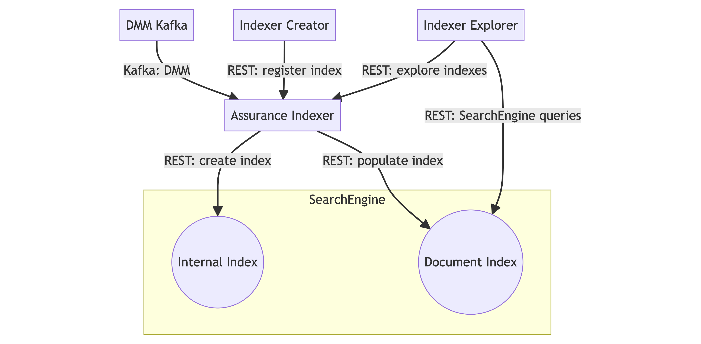

<!--- Document Template information:
Prepared:Gunnar Bergdahl
Approved:
Document Name:application-developers-guide-template
Revision: {!.bob/var.application-developers-guide-version!}
Date: {!.bob/var.date!}
--->

# Assurance Indexer Application Developers Guide

[TOC]

## Introduction

This document provides guidelines for how to use the Assurance Indexer service from an application developer’s point of
view.

It gives a brief description of the Assurance Indexer's main features and its interfaces.


### Revision History

| Date       | Revision    | Comment          | Author  |
|------------| -------------------- | ------------ |---------|
| 2023-09-13 | 0.0.1 | First draft  | EFRRDWR |
| ...       | ...                 | ...         | ...    |

## General Concept

The Assurance Indexer builds SearchEngine indexes for aggregation KPIs that have been configured by the Core Slice
Assurance Configurator (CSAC).

Indexes are defined by CSAC when the user provides _Index Specifications_. Index Specifications are composed of:
- An index specification name,
- An Input DMM Stream as a data source,
- The target output SearchEngine index name (matching the pattern `assurance*`)
- A writer section which specifies how Kafka records are transformed into SearchEngine documents

The resulting search documents are stored in SearchEngine indexes in the ADP Search Engine.

### Definitions

#### Input DMM Stream

A Kafka topic carrying the Avro formatted KPI record that is received from Performance Metrics Stats Calculator.
The Avro schema of the record received by the DMM stream is available in the schema registry in DMM.

#### SearchEngine document

Element within an SearchEngine index which stores the transformed records.

#### Writer

The instructions for the transformation of the Avro record to become one or many SearchEngine documents. Will add a document for each "value" found in the input record.

#### Record Fields

Fields of the input record which supply additional information. Includes Context Field, Value Field, and Info Field. They are defined in the Writer section of an Indexer Spec.

##### Context Field

Provides navigation context to the indexed documents. Example:

```json
{
  "name": "contextFieldA_name",
  "displayName": "ContextFieldA",
  "nameType": "straight",
  "recordName": "contextFieldA_recordName",
  "description": "contextFieldA description"
}
```

##### Value Field

Provides the KPI values stored on the document. Example:

```json
{
  "name": "valueFieldX_name",
  "displayName": "ValueFieldX",
  "type": "float",
  "recordName": "valueFieldX_recordName",
  "units": "valueFieldX Units",
  "description": "valueFieldX Description"
}
```

##### Info Field

Provides non-context fields for the document such as the beginning and ending timestamp fields. Example:

```json
{
  "name": "infoFieldZ_name",
  "type": "string",
  "recordName": "infoFieldZ_name",
  "description": "infoFieldZ Description"
}
```

## Application Integration

This section describes the integration of the Assurance Indexer with downstream systems and provides detailed descriptions of the resulting configuration in each system.

### Input DMM Stream (Kafka)
When a new Indexer specification is registered or the microservice restarts, the Kafka consumer listens to the topics based on the metadata available in the Indexer specifications.

The Assurance Indexer uses the Apache Avro data serialization system for Kafka (https://www.confluent.io/blog/avro-kafka-data/).

### SearchEngine
After records are generated by the DMM Data Producer, the index is stored in the ADP SearchEngine. The Network Assurance Dashboard references this index. The Core Slice Assurance Configurator then registers a new index with the Assurance Indexer which creates a new index in the Search Engine.

The Network Observability Dashboard also discovers available indexes to display through the Assurance Indexer service. The Assurance Indexer reads the input records as a DMM Data Consumer. It then stores a search document in the SearchEngine that was created by applying the Index Specification to each record.

A service, such as the Core Slice Assurance Configurator, registers an Index Specification with the Assurance Indexer. The Assurance Indexer then creates a new index in the Search Engine when an Index Specification is registered.

SearchEngine is available as part of the BSS Application Manager infrastructure. SearchEngine is already set up for logging purposes. Indexer uses the same service instance, not a separate SearchEngine. SearchEngine versions 12 and above have a restriction that needs to be worked around to allow the indexes that are created by the Indexer to be created and updated.

### values.yaml file helm chart
The default settings of the values.yaml file helm chart can be found here: [values.yaml](./../../charts/eric-oss-assurance-indexer/values.yaml)

## Interfaces



_Figure 1. Assurance Indexer microservice in the context of its application and external dependencies_

<!---
```mermaid
flowchart TD
    DMM[DMM Kafka] ->|Kafka: DMM| AssuranceIndexer
    subgraph SearchEngine
        InternalIndex((Internal Index))
        DocumentIndex((Document Index))
    end
    IndexerCreator[Indexer Creator] -> |REST: register index| AssuranceIndexer[Assurance Indexer]
    IndexerExplorer[Indexer Explorer] -> |REST: explore indexes| AssuranceIndexer
    AssuranceIndexer -> |REST: populate index| DocumentIndex
    AssuranceIndexer -> |REST: create index| InternalIndex
    IndexerExplorer -> |REST: SearchEngine queries| DocumentIndex
```
--->

The flow during regular operation is as follows: Indexer reads from Kafka Avro records (schema registry). It then processes the path of the records and produces documents which are then put into Document Index in SearchEngine.


### Indexer API Endpoint
The endpoint `/v1/indexer-info/indexer` performs different actions related to Indexers registered to a Search Engine index depending on the REST Request method used:

#### PUT
Registers an indexer, which reads DMM records and adds corresponding documents to a target Search Engine index. If the indexer does not already exist, creates it. If a previous indexer of the same name exists, overwrites it.

Using this method requires a Request body with the following format:

```json
{
  "name": "nameOfIndexerA",
  "description": "Description of Indexer A",
  "source": {
    "type": "pmstatsexporter",
    "name": "DataCatalog DataSource name"
  },
  "target": {
    "name": "assurance-index-A",
    "displayName": "SearchIndexA_DisplayName",
    "indexDescription": "SearchIndexA_Description"
  },
  "writers": [
    {
      "name": "writerA_name",
      "inputSchema": "writerA_schemaRegistryName",
      "context": [
        {
          "name": "contextFieldA_name",
          "displayName": "ContextFieldA",
          "nameType": "straight",
          "recordName": "contextFieldA_recordName",
          "description": "contextFieldA description"
        }
      ],
      "value": [
        {
          "name": "valueFieldX_name",
          "displayName": "ValueFieldX",
          "type": "float",
          "recordName": "valueFieldX_recordName",
          "units": "valueFieldX Units",
          "description": "valueFieldX Description"
        }
      ],
      "info": [
        {
          "name": "infoFieldZ_name",
          "type": "string",
          "recordName": "infoFieldZ_name",
          "description": "infoFieldZ Description"
        }
      ]
    }
  ]
}
```

If the operation receives a Bad Request, this endpoint will return a response body containing the following problem statement:

```json
{
  "type": "string",
  "title": "string",
  "status": 0,
  "detail": "string",
  "instance": "string"
}
```

#### GET
Retrieves a specific Indexer by name.

In the request body, the name of the Indexer is passed as `name`.

If the operation is successful, this endpoint will return a response body containing the requested indexer as follows:

```json
[
  {
    "name": "nameOfIndexerA",
    "description": "Description of Indexer A",
    "source": {
      "type": "pmstatsexporter",
      "name": "DataCatalog DataSource name"
    },
    "target": {
      "name": "assurance-index-A",
      "displayName": "SearchIndexA_DisplayName",
      "indexDescription": "SearchIndexA_Description"
    },
    "writers": [
      {
        "name": "writerA_name",
        "inputSchema": "writerA_schemaRegistryName",
        "context": [
          {
            "name": "contextFieldA_name",
            "displayName": "ContextFieldA",
            "nameType": "straight",
            "recordName": "contextFieldA_recordName",
            "description": "contextFieldA description"
          }
        ],
        "value": [
          {
            "name": "valueFieldX_name",
            "displayName": "ValueFieldX",
            "type": "float",
            "recordName": "valueFieldX_recordName",
            "units": "valueFieldX Units",
            "description": "valueFieldX Description"
          }
        ],
        "info": [
          {
            "name": "infoFieldZ_name",
            "type": "string",
            "recordName": "infoFieldZ_name",
            "description": "infoFieldZ Description"
          }
        ]
      }
    ]
  }
]
```

If the operation instead receives an invalid Indexer name, this endpoint will return a response body containing the following problem statement:

```json
{
  "type": "string",
  "title": "string",
  "status": 0,
  "detail": "string",
  "instance": "string"
}
```

#### DELETE
Deletes an Indexer, effectively stopping the writing of documents to the target index. Does not delete the SearchEngineIndex created by the Indexer.

In the request body, the name of the Indexer is passed as `name`.

If the operation is successful, this endpoint will return a response body containing the requested indexer as follows:

```json
[
  {
    "name": "nameOfIndexerA",
    "description": "Description of Indexer A",
    "source": {
      "type": "pmstatsexporter",
      "name": "DataCatalog DataSource name"
    },
    "target": {
      "name": "assurance-index-A",
      "displayName": "SearchIndexA_DisplayName",
      "indexDescription": "SearchIndexA_Description"
    },
    "writers": [
      {
        "name": "writerA_name",
        "inputSchema": "writerA_schemaRegistryName",
        "context": [
          {
            "name": "contextFieldA_name",
            "displayName": "ContextFieldA",
            "nameType": "straight",
            "recordName": "contextFieldA_recordName",
            "description": "contextFieldA description"
          }
        ],
        "value": [
          {
            "name": "valueFieldX_name",
            "displayName": "ValueFieldX",
            "type": "float",
            "recordName": "valueFieldX_recordName",
            "units": "valueFieldX Units",
            "description": "valueFieldX Description"
          }
        ],
        "info": [
          {
            "name": "infoFieldZ_name",
            "type": "string",
            "recordName": "infoFieldZ_name",
            "description": "infoFieldZ Description"
          }
        ]
      }
    ]
  }
]
```

If the operation instead receives an invalid Indexer name, this endpoint will return a response body containing the following problem statement:

```json
{
  "type": "string",
  "title": "string",
  "status": 0,
  "detail": "string",
  "instance": "string"
}
```

### Indexer List API Endpoint
The endpoint `/v1/indexer-info/indexer-list` is responsible for retrieving the list of registered Indexers.

This endpoint will return a response body containing an array of unique sets of pairs of the Indexers and their
description as follows:

```json
[
  {
    "name": "nameOfIndexerA",
    "description": "Description of Indexer A"
  }
]
```

### SearchEngineIndex List API Endpoint
The endpoint `/v1/indexer-info/search-engineindex-list` is responsible for retrieving the list of registered
SearchEngineIndexes.

This endpoint will return a response body containing an array of unique sets of the SearchEngineIndexes, their
displayName and their descriptions as follows:

```json
[
  {
    "name": "SearchIndexA_Name",
    "displayName": "SearchIndexA_DisplayName",
    "indexDescription": "SearchIndexA_Description"
  }
]
```

### Spec Contexts API Endpoint
The endpoint `/v1/indexer-info/spec/contexts` is responsible for retrieving the ContextFieldSpecs for a
SearchEngineIndex and FullContext documentName.

In the request body:
* The name of the SearchEngineIndex is passed as `searchEngineIndexName`.
* The name of the FullContext is passed as `fullContext`.

If the operation is successful, this endpoint will return a response body containing an array of unique data sets as
follows:

```json
[
  {
    "name": "contextFieldA-name",
    "displayName": "Context Field A",
    "documentName": "c_contextFieldA-name",
    "description": "contextFieldA description"
  }
]
```

If the operation instead receives an invalid searchEngineIndexName or fullContextDocumentName, this endpoint will return
a response body containing the following problem statement:

```json
{
  "type": "string",
  "title": "string",
  "status": 0,
  "detail": "string",
  "instance": "string"
}
```

### Spec Metrics API Endpoint
The endpoint `/v1/indexer-info/spec/metrics` is responsible for retrieving the ValueContextSpecs for a SearchEngineIndex
and FullContext documentName.

In the request body:
* The name of the SearchEngineIndex is passed as `searchEngineIndexName`.
* The name of the FullContext is passed as `fullContext`.

If the operation is successful, this endpoint will return a response body containing an array of unique data sets as
follows:

```json
[
  {
    "valueName": "valueFieldX-name",
    "valueContextName": "NF-valueFieldX-name",
    "valueContextDocumentName": "value_context",
    "valueDocumentName": "vd_ContextA_ContextB_valueFieldX-name",
    "description": "valueFieldX Description"
  }
]
```

If the operation instead receives an invalid searchEngineIndexName or fullContextDocumentName, this endpoint will return
a response body containing the following problem statement:

```json
{
  "type": "string",
  "title": "string",
  "status": 0,
  "detail": "string",
  "instance": "string"
}
```

### getFullContexts API Endpoint
The endpoint `/v1/indexer-info/fullcontexts` is responsible for retrieving the list of FullContexts for a
SearchEngineIndex

In the request body, the name of the SearchEngineIndex is passed as `searchEngineIndexName`.

If the operation is successful, this endpoint will return a response body containing an array of information related to
the SearchEngineIndex, including sub-arrays containing its context fields and metric fields, as follows:

```json
[
  {
    "searchEngineIndexName": "searchEngineIndexName",
    "name": "ContextA_ContextB_ContextC",
    "displayName": "ContextA & ContextB & ContextC",
    "contextFields": [
      {
        "name": "contextFieldA_name",
        "displayName": "ContextFieldA",
        "nameType": "straight",
        "recordName": "contextFieldA_recordName",
        "description": "contextFieldA description"
      }
    ],
    "metricFields": [
      {
        "name": "valueFieldX_name",
        "displayName": "ValueFieldX",
        "type": "float",
        "recordName": "valueFieldX_recordName",
        "units": "valueFieldX Units",
        "description": "valueFieldX Description"
      }
    ]
  }
]
```

If the operation instead receives an invalid searchEngineIndexName or valueName, this endpoint will return a response
body containing the following problem statement:

```json
{
  "type": "string",
  "title": "string",
  "status": 0,
  "detail": "string",
  "instance": "string"
}
```

Further information about the Assurance Indexer's API endpoints can be found by inputting the  [OpenAPI file](./../../src/main/resources/v1/eric-oss-assurance-indexer-openapi.yaml)
into the
[Internal Ericsson Swagger Editor](https://apiguild.internal.ericsson.com/beta/editor/).

## Limitations

- One Index Specification can only read from one topic and write to one interface (workaround index specs)
- Processing of Kafka will only be detected if the Kafka topic is partitioned correctly
- Only indexes with the prefix `assurance` are currently accepted
- Time to live is not implemented
- Historical data is not preserved

## Appendix

[Assurance Indexer gerrit repository](https://gerrit-gamma.gic.ericsson.se/#/admin/projects/OSS/com.ericsson.oss.air/eric-oss-assurance-indexer)
[Ericsson Core Assurance in OSS Portfolio Architecture](https://oss-architecture.seli.wh.rnd.internal.ericsson.com/domains/planned/assurance-insights-and-reporting/ericsson-core-assurance.html)

## References

[ADP Generic Services Support JIRA][jira]

[jira]: https://eteamproject.internal.ericsson.com/projects/GSSUPP
